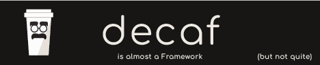

[](https://decaf-ts.github.io/for-testing/)
## @decaf-ts/for-testing

Testing toolkit for decaf-ts packages: evidence reporting, jest helpers, performance running and Xray/AgileTest teardowns, with a UI testing surface.


[](https://github.com/decaf-ts/for-testing/actions/workflows/nodejs-build-prod.yaml)
[](https://github.com/decaf-ts/for-testing/actions/workflows/codeql-analysis.yml)[](https://github.com/decaf-ts/for-testing/actions/workflows/snyk-analysis.yaml)
[](https://github.com/decaf-ts/for-testing/actions/workflows/pages.yaml)
[](https://github.com/decaf-ts/for-testing/actions/workflows/release-on-tag.yaml)


Documentation [here](https://decaf-ts.github.io/for-testing/), Test results [here](https://decaf-ts.github.io/for-testing/workdocs/reports/html/test-report.html) and Coverage [here](https://decaf-ts.github.io/for-testing/workdocs/reports/coverage/lcov-report/index.html)


### Description

`@decaf-ts/for-testing` is the testing toolkit for decaf-ts packages. It packages the
evidence and reporting pipeline that used to live under `@decaf-ts/utils/tests` into its own
repository so runtime packages no longer carry test-only code.

The backend toolkit is the default export of the package root:

- `TestReporter` — collects test evidence (messages, objects, tables, attachments) into a
  report storage directory (defaults via `TEST_REPORTER_STORAGE_ENABLED` /
  `TEST_REPORTER_STORAGE_PATH`).
- `ConsumerRunner` — consumer/producer orchestration: forks the producer child process,
  collects consumer and producer logs, and compares them (through `defaultComparer` or
  `reportingComparer`) to assert ordering and interleaving across forked processes.
- jest helpers (`itReportsOnFailure`, `ReportExpect`) — report failures and evidence directly
  from jest tests, backed by the reporter plumbing (`ensureReporterCollectsEvidencesConfig`,
  `setReporter` / `getReporter`, `reportObjects`) and `runAndReport` for command-execution
  evidence.
- `JestPerformanceRunner` — runs performance scenarios and reports phase tables and charts.
- `runJestXrayTeardown` / `runJestAgileTestTeardown` — convert the JUnit report and evidence
  directories into Xray and AgileTest import payloads; the Xray teardown is gated by
  `ENABLE_XRAY_REPORT`, the AgileTest payload is always written locally, and uploads only
  happen when the respective credentials are configured.

UI-specific helpers are grouped under the `ui` namespace, exported both as the `ui` named
export of the package root and as the `@decaf-ts/for-testing/ui` subpath. No UI helpers exist
yet, so that surface is intentionally minimal but stable for future browser and component helpers.

```typescript
// backend toolkit (default)
import { TestReporter, itReportsOnFailure } from "@decaf-ts/for-testing";

// UI toolkit (named namespace)
import { ui } from "@decaf-ts/for-testing";
import * as ui from "@decaf-ts/for-testing/ui";
```

#### Migrating from `@decaf-ts/utils/tests`

`@decaf-ts/utils/tests` remains published and unchanged, so nothing forces an immediate
migration. When you are ready:

1. Install the new package (`npm install --save-dev @decaf-ts/for-testing`) and rewrite the
   imports: `@decaf-ts/utils/tests` → `@decaf-ts/for-testing`. The backend export surface
   (`TestReporter`, the jest helpers, `ConsumerRunner`-based orchestration, the performance
   runner and the teardowns) is unchanged — only the import path moved.
2. Optionally adopt the new surfaces this package adds: the `ui` namespace and
   `@decaf-ts/for-testing/ui` subpath (reserved, currently empty but stable), and the
   `VERSION` / `COMMIT` / `FULL_VERSION` / `PACKAGE_NAME` build constants.


### How to Use

- [Installation](#installation)
- [Backend toolkit examples](#backend-toolkit-examples)
- [UI toolkit surface](#ui-toolkit-surface)
- [Initial Setup](./workdocs/tutorials/For%20Developers.md#_initial-setup_)
- [Installation](./workdocs/tutorials/For%20Developers.md#installation)
- [Scripts](./workdocs/tutorials/For%20Developers.md#scripts)
- [Linting](./workdocs/tutorials/For%20Developers.md#testing)
- [CI/CD](./workdocs/tutorials/For%20Developers.md#continuous-integrationdeployment)
- [Publishing](./workdocs/tutorials/For%20Developers.md#publishing)
- [Structure](./workdocs/tutorials/For%20Developers.md#repository-structure)
- [IDE Integrations](./workdocs/tutorials/For%20Developers.md#ide-integrations)
  - [VSCode(ium)](./workdocs/tutorials/For%20Developers.md#visual-studio-code-vscode)
  - [WebStorm](./workdocs/tutorials/For%20Developers.md#webstorm)
- [Considerations](./workdocs/tutorials/For%20Developers.md#considerations)

#### Installation

```sh
npm install --save-dev @decaf-ts/for-testing
```

Requires Node >= 20 and npm >= 10. The package ships ESM and CJS builds from the package root,
plus the `./ui` subpath for the UI testing surface.

The reporting integrations `jest-html-reporters`, `json2md` and `chartjs-node-canvas` are
declared as optional peer dependencies: they are only needed when you use the corresponding
reporter features (HTML evidence rendering, markdown tables, charts). When a feature runs
without its dependency available, the reporter installs it on demand at runtime, so a plain
install works without pre-declaring anything.

#### Backend toolkit examples

##### Evidence reporting in jest

Install the test-scoped reporter once, typically in a jest setup file:

```typescript
import {
  TestReporter,
  ensureReporterCollectsEvidencesConfig,
  setReporter,
} from "@decaf-ts/for-testing";

await ensureReporterCollectsEvidencesConfig();
setReporter(new TestReporter());
```

`ensureReporterCollectsEvidencesConfig` defaults `TEST_REPORTER_STORAGE_ENABLED` and
`TEST_REPORTER_STORAGE_PATH`, so evidence collection is on for tests using the jest helpers.

Then report failures and chained assertions from your tests:

```typescript
import {
  itReportsOnFailure,
  ReportExpect,
  getReporter,
  reportObjects,
} from "@decaf-ts/for-testing";

itReportsOnFailure("creates a resource", async () => {
  const response = await fetch("https://example.org/api/resource", { method: "POST" });

  const report = new ReportExpect();
  report.assertToBe(200, response.status, "status");
  report.assertToContain(await response.text(), "created", "body");

  await reportObjects(getReporter(), report, response);
});
```

`itReportsOnFailure` persists the failure `message` and `cause` through the test-scoped
reporter before rethrowing; `reportObjects` writes the response and the accumulated report
and throws when the chain carries failed assertions.

When evidence storage is enabled, reported evidence file names are derived from the
`reference` argument and sanitized: the reference is reduced to its base name, any character
outside `A-Za-z0-9._-` is replaced with `-`, and leading dots and dashes are stripped. Evidence
is always written inside the configured evidence root — a reference that would resolve outside
it is refused with an error.

##### Consumer/producer orchestration

```typescript
import { ConsumerRunner, defaultComparer } from "@decaf-ts/for-testing";

const runner = new ConsumerRunner(
  "create",
  async (identifier: number) => {
    // consume one producer iteration
    return "";
  },
  defaultComparer
);

const result = await runner.run(5, 100, 5, true);
```

`ConsumerRunner` forks the producer child process, collects the producer and consumer logs,
and resolves with a `ComparerResult` holding both parsed log sets for the comparison.

##### Xray / AgileTest teardown

```typescript
import { runJestXrayTeardown, runJestAgileTestTeardown } from "@decaf-ts/for-testing";

// Xray: the teardown only runs when ENABLE_XRAY_REPORT === "true"
process.env.ENABLE_XRAY_REPORT = "true";
await runJestXrayTeardown();

// AgileTest: the upload is skipped without AGILETEST_HOST/AGILETEST_EMAIL/AGILETEST_API_TOKEN
await runJestAgileTestTeardown();
```

Both teardowns read the JUnit report (`JUNIT_PATH`) and the evidence root
(`ASSETS__PATH`/`TEST_REPORTER_STORAGE_PATH`), and always write the import payload locally
(`workdocs/reports/evidences/tests/xray.json` / `agiletest.json`); the upload only happens
when the respective credentials are configured.

#### UI toolkit surface

```typescript
import { ui } from "@decaf-ts/for-testing";
import * as ui from "@decaf-ts/for-testing/ui";
```

Both import paths resolve to the same module. No UI helpers exist yet; the surface is stable,
so helpers added later become available through both paths without a breaking change.


### Related

[](https://github.com/decaf-ts/for-testing)
[](https://github.com/decaf-ts/utils)


### Social

[](https://www.linkedin.com/in/TiagoVenceslau/)


#### Languages


## Getting help

If you have bug reports, questions or suggestions, please [create a new issue](https://github.com/decaf-ts/for-testing/issues/new/choose).

## Contributing

I am grateful for any contributions made to this project. Please read [this](./workdocs/98-Contributing.md) to get started.

## Supporting

The first and easiest way you can support it is by [Contributing](./workdocs/tutorials/Contributing.md). Even just finding a typo in the documentation is important.

Financial support is always welcome and helps keep both me and the project alive and healthy.

So if you can, if this project in any way. either by learning something or simply by helping you save precious time, please consider donating.

## License

This project is released under the [MIT License](./LICENSE.md).

By developers, for developers...